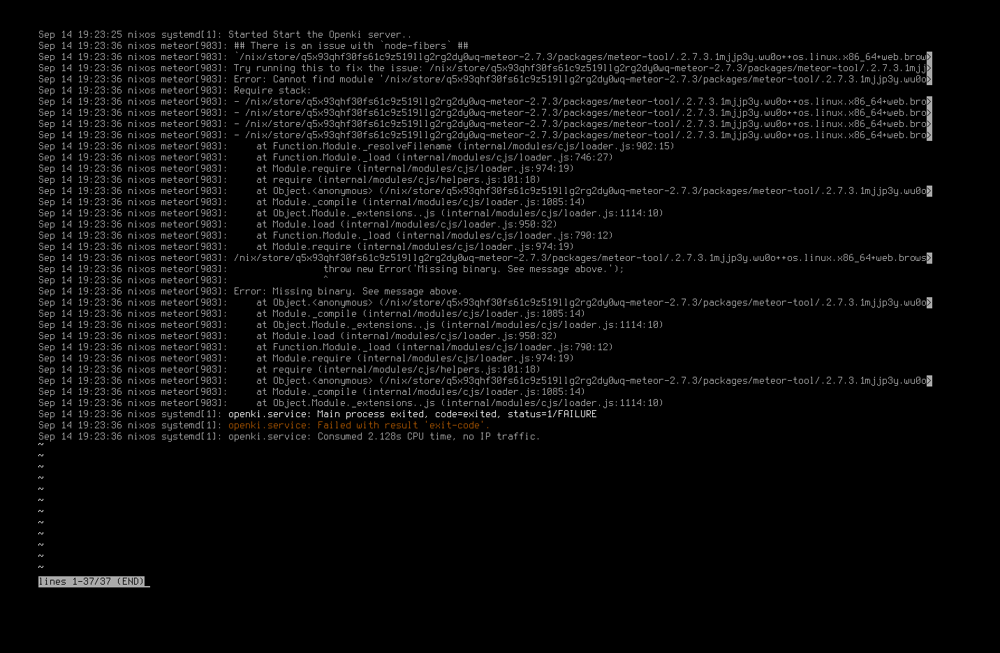

# Openki

NGI-Nix Flake for Openki - <https://gitlab.com/Openki/Openki>

## Commands to run

- `nix run .#vm-clear-state`
  - Cleanup the VM state
- `nix run .#vm`
  - Starts a VM with the openki module
  - Currently hangs on building manpages
  - See error message below when it does work
- `nix run .#nixos-shell`
  - Starts a fancier vm in your shell
  - Login with `root` and no password, quit with `shutdown now`
  - Doesn't have the openki module, can't figure out why

## VM openki service error message

